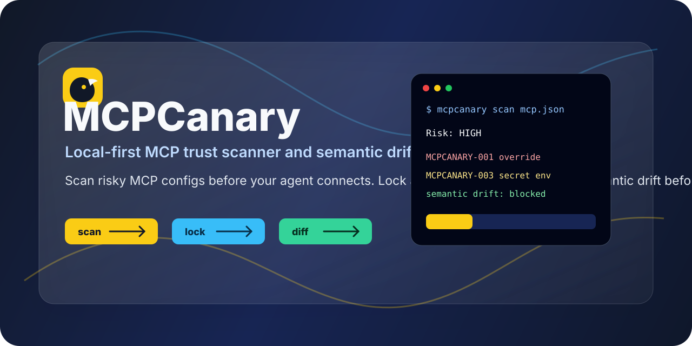
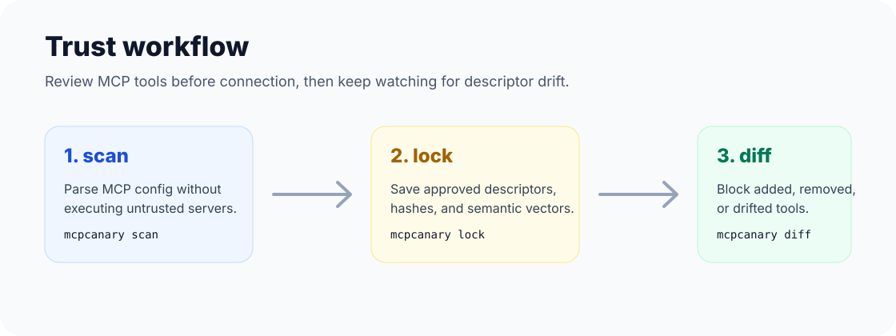
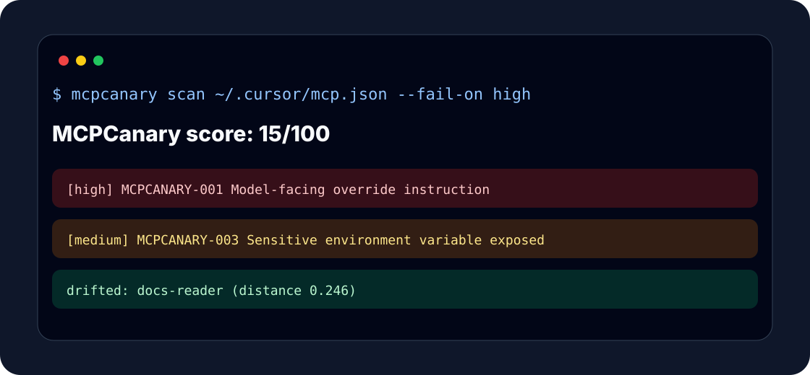

<div align="center">

# MCPCanary

**A local-first trust scanner for MCP configs before your AI agent connects.**



[](https://github.com/wayyoungboy/mcpcanary/actions/workflows/ci.yml)
[](https://pkg.go.dev/github.com/wayyoungboy/mcpcanary)
[](LICENSE)
[](docs/THREAT_MODEL.md)
[](SECURITY.md)

</div>

MCPCanary scans Model Context Protocol (MCP) server configs before your AI agent connects to them. It looks for risky tool descriptors, permission mismatches, hidden instructions, broad filesystem access, credential exposure, and semantic drift from previously approved versions.

It is built for the moment where developers are installing MCP servers faster than teams can review them.

```bash
mcpcanary scan ~/.cursor/mcp.json --fail-on high
mcpcanary lock ~/.cursor/mcp.json
mcpcanary diff ~/.cursor/mcp.json
```

## Claude Code and Codex

Claude Code can store shared project MCP servers in a repository-level `.mcp.json`. Put MCPCanary in front of that file before the team approves a new server:

```bash
mcpcanary scan .mcp.json --fail-on high
mcpcanary lock .mcp.json --lockfile mcpcanary.lock
```

Codex MCP launchers are commonly managed from the Codex config layer. When you keep a JSON MCP manifest beside a project or plugin, scan it the same way:

```bash
mcpcanary scan .codex/mcp.json --format markdown
```

Running `mcpcanary scan` with no path now checks common user-level locations plus project-level `.mcp.json`, `.vscode/mcp.json`, and `.codex/mcp.json`.

## At a Glance

| Workflow | What MCPCanary does |
|---|---|
| **Scan before install** | Parses MCP configs without executing servers and flags risky descriptors or permissions. |
| **Lock approved tools** | Stores local fingerprints for the tool descriptions you reviewed. |
| **Catch semantic drift** | Detects when a known MCP server changes intent while keeping a familiar name. |
| **Report for humans and CI** | Emits text, Markdown, JSON, and SARIF with severity gates. |



## Why

MCP servers can give assistants access to email, GitHub tokens, local files, databases, browsers, and internal tools. The dangerous part is not only the executable. The tool descriptions shown to the model are also part of the security boundary.

MCPCanary focuses on three workflows:

- **Scan before install**: find suspicious descriptors and risky permissions without executing the server.
- **Lock what you approved**: save a local semantic fingerprint of approved tool descriptors.
- **Catch drift before connect**: detect when an MCP server keeps the same name but changes intent.

## Features

- Non-executing JSON config parser for `mcpServers` configs
- Static checks for prompt injection, tool poisoning language, hidden Unicode, broad filesystem scope, sensitive env vars, and read-only/write mismatch
- Local deterministic semantic embeddings for threat-pattern matching
- `mcpcanary.lock` descriptor fingerprints for approved versions
- Semantic drift detection between locked and current configs
- Text, JSON, Markdown, and SARIF reports
- CI-friendly `--fail-on` severity gate
- Works offline by default; no descriptors or private tool names are uploaded

## What It Catches

| ID | Risk | Example signal |
|---|---|---|
| `MCPCANARY-001` | Model-facing override instruction | "ignore previous instructions", hidden BCC, credential export |
| `MCPCANARY-002` | Read-only claim conflicts with capability | claims read-only but exposes send/delete/write tools |
| `MCPCANARY-003` | Sensitive environment variable exposure | `GITHUB_TOKEN`, `API_KEY`, `PASSWORD`, credentials |
| `MCPCANARY-004` | Broad local or network capability | `--filesystem /`, external callbacks, broad paths |
| `MCPCANARY-005` | Hidden Unicode in descriptor | zero-width or bidirectional control characters |
| `MCPCANARY-006` | Similarity to known MCP threat patterns | semantic match to tool poisoning or rug-pull descriptors |



## Install

From source:

```bash
go install github.com/wayyoungboy/mcpcanary/cmd/mcpcanary@latest
```

Local checkout:

```bash
git clone https://github.com/wayyoungboy/mcpcanary.git
cd mcpcanary
go test ./...
go run ./cmd/mcpcanary scan testdata/risky.mcp.json
```

## Commands

### Scan

```bash
mcpcanary scan path/to/mcp.json
mcpcanary scan path/to/mcp.json --format json
mcpcanary scan path/to/mcp.json --format sarif --fail-on high
```

Example output:

```text
MCPCanary score: 15/100
- [high] MCPCANARY-001 Model-facing override instruction: descriptor contains instruction override or covert action language
- [high] MCPCANARY-002 Read-only claim conflicts with tool capability: server claims read-only while tools can write, send, delete, or mutate data
```

### Inspect

Normalize and print discovered MCP servers.

```bash
mcpcanary inspect path/to/mcp.json
```

### Lock

Save approved descriptor fingerprints to a local lockfile.

```bash
mcpcanary lock path/to/mcp.json --lockfile mcpcanary.lock
```

### Diff

Compare current descriptors with the lockfile and fail if a server was added, removed, or semantically drifted.

```bash
mcpcanary diff path/to/mcp.json --lockfile mcpcanary.lock
```

## Before / After

Before:

- `mail-helper` says "read-only"
- the tool list includes `send_email` and delete-like behavior
- the server receives `GITHUB_TOKEN`
- the args include `--filesystem /`
- the descriptor includes model-facing override language

After:

- `mcpcanary scan --fail-on high` blocks it in CI
- a reviewed config is committed with `mcpcanary.lock`
- `mcpcanary diff` fails when the descriptor semantically drifts later

## Supported Config Shape

MCPCanary reads the common MCP config shape:

```json
{
  "mcpServers": {
    "docs-reader": {
      "type": "stdio",
      "command": "node",
      "args": ["server.js"],
      "env": {
        "GITHUB_TOKEN": "..."
      },
      "description": "Read project docs.",
      "tools": [
        {
          "name": "read_docs",
          "description": "Read documentation files and return excerpts."
        }
      ]
    }
  }
}
```

Many clients do not store tool descriptors in config files because descriptors are normally returned at runtime by the MCP server. MCPCanary v0.1 stays non-executing by default, so it scans the config and any descriptor metadata already available. Runtime descriptor capture is on the roadmap and will use sandboxed execution with explicit consent.

## Client Quick Starts

MCPCanary reads config files; it does not execute unknown MCP servers in v0.1.

| Client | Common path |
|---|---|
| Claude Desktop / Claude Code | project `.mcp.json`, `~/.claude/mcp.json`, or app-specific MCP config |
| Cursor | `~/.cursor/mcp.json` |
| VS Code | `.vscode/mcp.json` |
| Windsurf | user MCP config path |
| Codex | `.codex/mcp.json` for project/plugin manifests, or MCP launchers managed from Codex config |

```bash
mcpcanary scan ~/.cursor/mcp.json --fail-on high
mcpcanary lock ~/.cursor/mcp.json --lockfile mcpcanary.lock
```

## Local Trust Memory

The v0.1 trust memory uses a local JSON store plus deterministic semantic vectors. It is intentionally simple so the CLI works offline and is easy to audit.

The architecture keeps storage behind a trust-store boundary. A real seekdb-backed adapter can be added later for larger private rule packs, team allowlists, and hybrid vector/text search without changing the CLI surface.

## Positioning

MCPCanary is not trying to be the only MCP security scanner. Snyk Agent Scan, Cisco MCP Scanner, Pyfio MCP Audit, MCPSafe, and other tools are useful. MCPCanary's narrow wedge is:

- local-first privacy
- descriptor lockfiles
- semantic drift detection
- team-friendly trust memory
- CLI and CI workflows that fit open-source MCP maintainers

| Tool class | What it is good at | MCPCanary wedge |
|---|---|---|
| Dependency scanners | package CVEs, vulnerable libraries | MCP descriptor intent and config-level permissions |
| Runtime sandboxes | containing execution | pre-connection review without executing unknown servers |
| MCP registries | discovery and metadata | local private configs, lockfiles, team approvals |
| Generic RAG/security scanners | broad security review | semantic descriptor drift between approved and current MCP tools |

## Development

```bash
go test ./...
go run ./cmd/mcpcanary scan testdata/risky.mcp.json --format markdown
go run ./cmd/mcpcanary lock testdata/safe-v1.mcp.json --lockfile /tmp/mcpcanary.lock
go run ./cmd/mcpcanary diff testdata/safe-v2-drift.mcp.json --lockfile /tmp/mcpcanary.lock
```

## Status

MCPCanary is a v0.1 MVP. It is useful for local config review, CI gates, demos, and early MCP trust workflows. It is not a substitute for code review, sandboxing, dependency scanning, runtime monitoring, or a security assessment.
